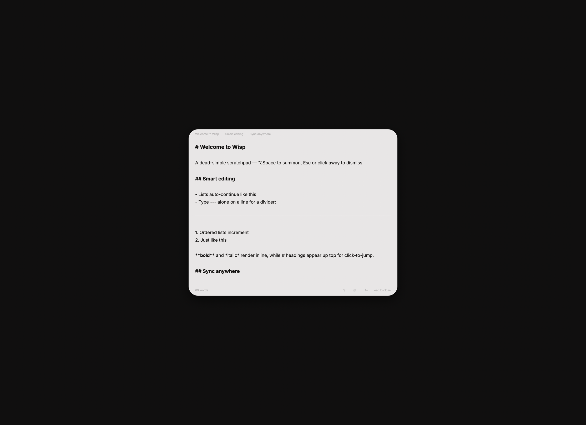

# Wisp

A dead-simple macOS scratchpad. ⌃⌥. to summon, type, Esc or click away to dismiss.

<p align="center">
  
</p>

## Install

Requires macOS 13 (Ventura) or later, Apple silicon. This is a personal fork
with no release pipeline.

```sh
./scripts/install.sh
```

Builds and copies to `/Applications/Wisp.app` (override with
`WISP_INSTALL_DIR`). Launch it, then enable **Launch at Login** from the menu
bar menu if you want it. Installing to a stable path matters for that: the
login item is recorded against the bundle's location, so running from
`dist/` means a rebuild or a move can orphan it.

```sh
./scripts/uninstall.sh            # removes the app, keeps your config
./scripts/uninstall.sh --purge    # also removes ~/.config/wisp
```

Uninstall quits the running copy first. Turn Launch at Login **off before**
uninstalling — the registration is keyed to the bundle, so deleting the app
first leaves a dangling login item.

## Features

- **⌃⌥.** to summon from anywhere (rebindable)
- **Light / dark / system** appearance — one-click cycle, follows macOS by default
- **Smart editing** — lists auto-continue, `---` becomes a divider, `**bold**` and `*italic*` render inline
- **Bulleted lists** — `- ` renders as a real bullet with a hanging indent; ⇥ / ⇧⇥ nest and un-nest an item
- **Headings** — `#`, `##`, `###` render styled with click-to-jump navigation
- **Emoji shortcodes** — `:rocket:` `:fire:` `:heart:` `:check:` and more
- **Bold / Italic / Highlight** — ⌘B, ⌘I (`_text_`), ⌥H (`==text==`)
- **Line editing** — ⌘D duplicates the line or selection; ⌥↑ / ⌥↓ move it; ⌘C / ⌘X take the whole line when nothing is selected
- **⌥L** makes the line a list item, or unmakes it
- **Text size** — ⌘= / ⌘- step it, ⌘0 resets, and the footer has buttons for both
- **Launch at Login** — toggle in the menu bar menu
- **Refresh** — ⌘R re-reads the config and the note from disk
- **Live reload** — changes to either from another app, Mac, or sync client appear on their own
- **Plain markdown on disk** at `~/Documents/scratchpad.md`
- **Sync across Macs** — point at any folder via the menu bar menu (iCloud Drive, Dropbox, Syncthing all work)
- **Every shortcut rebindable** in the config
- **Hand-editable config** at `~/.config/wisp/wisp.jsonc` — see below

Press ⌘/ — or click the `?` in the footer — for the full keyboard shortcut list.

## Configuration

Everything Wisp persists lives in `~/.config/wisp/wisp.jsonc` (or
`$XDG_CONFIG_HOME/wisp/wisp.jsonc`), seeded with defaults on first run and
openable from **Settings…** in the menu bar menu. Comments and trailing commas
are fine — it is read as JSON5. A key that's missing takes its default; a key
that's present but the wrong shape is named in the footer rather than silently
ignored.

| Key                     | Default                   | What it does                                                                                                                 |
| ----------------------- | ------------------------- | ---------------------------------------------------------------------------------------------------------------------------- |
| `theme`                 | `"system"`                | `light`, `dark`, or follow macOS                                                                                             |
| `fonts.notes`           | `"Inter Nerd Font"`       | The notes body face                                                                                                          |
| `fonts.ui`              | `"Inter Nerd Font Propo"` | Header, footer, and overlays                                                                                                 |
| `fontScale`             | `1.0`                     | Multiplies every type size, body and chrome. ⌘= / ⌘- step it by 0.1. Clamped to 0.6–2.5                                     |
| `saveIndicator`         | `true`                    | Flashes a dot in the top corner each time the note is written                                                                 |
| `defaultFontScale`      | `1.0`                     | What ⌘0 resets `fontScale` to                                                                                                |
| `indent.style`          | `"spaces"`                | `spaces` or `tabs` — what Tab writes                                                                                         |
| `indent.size`           | `2`                       | Spaces per level. Ignored under `tabs`                                                                                       |
| `vibrancy`              | `true`                    | Blurs whatever is behind the panel                                                                                           |
| `monitor`               | `"primary"`               | `pointer` opens on whichever display the cursor is on                                                                        |
| `dismissOnOutsideClick` | `true`                    | Clicking another app dismisses the panel                                                                                        |
| `position`              | `"auto"`                  | `auto` opens the panel centred, top edge a tenth down the screen, and pins it there; `manual` leaves it wherever you drag it |
| `scratchpadPath`        | `""`                      | Folder for `scratchpad.md`; empty means `~/Documents`                                                                        |
| `keymap.*`              | _(see below)_             | Every shortcut, rebindable. `keymap.summon` is the global chord, e.g. `cmd+shift+space`                                      |
| `panel`                 | _(written on first hide)_ | Remembered `width` / `height`, plus `x` / `y` once the panel has been dragged under `manual`                                 |

### Keymap

Every binding lives under `keymap`, written out in full on first run. A chord
is modifiers plus a key, in any order — `cmd+shift+d`, `opt+up`, `ctrl+opt+.`.

An action can take a list instead of a single chord, and every entry binds —
`"help": ["f1", "cmd+/"]` reaches the same page two ways.

| Action                                    | Default    |
| ----------------------------------------- | ---------- |
| `summon`                                  | `ctrl+opt+.` |
| `find` / `settings` / `refresh`           | `cmd+f` / `cmd+,` / `cmd+r` |
| `revealNote`                              | `opt+cmd+r` |
| `help`                                    | `["f1", "cmd+/"]` |
| `bold` / `italic` / `highlight` / `underline` | `cmd+b` / `cmd+i` / `opt+h` / `cmd+u` |
| `toggleTheme`                             | `cmd+t` |
| `duplicateLine` / `toggleListItem`        | `cmd+d` / `opt+l` |
| `moveLineUp` / `moveLineDown`             | `opt+up` / `opt+down` |
| `increaseFontScale` / `decreaseFontScale` / `resetFontScale` | `cmd+=` / `cmd+-` / `cmd+0` |

**F1 only reaches Wisp if your Mac is set to "Use F1, F2, etc. as standard
function keys"** (Keyboard settings). Otherwise F1 dims the display and the
app never sees it — press fn+F1, or use the `cmd+/` alias.

Underline writes `<u>…</u>`: markdown has none, `__` is already bold here,
and `<u>` is what Obsidian's own underline command inserts.

`summon` is the only global one — the rest need Wisp's panel in front of you,
except `find`, `settings`, and `refresh`, which open it. The menu bar menu
prints each item's chord from this table, and those actions fire with the menu
closed too. A chord that doesn't
parse is dropped; an action left with no working chord at all is named in the
footer.

Neither font is bundled — both are referenced by name, and Wisp falls back to
the system face (and says so in the footer) when one isn't installed.

Wisp rewrites only the key it changed, so hand-added comments, key order, and
indentation all survive a settings change made from the UI.

The config directory and the scratchpad's folder are both watched, so a change
to either — a hand edit, a `chezmoi apply`, another Mac's copy landing over
iCloud Drive — applies without a Refresh. Everything but `vibrancy` takes effect
live. If a watch can't start, the footer says so and ⌘R still works.

## Build

```sh
./scripts/build.sh
open dist/Wisp.app
```

```sh
./scripts/test.sh
```

No Xcode required — Command Line Tools are enough. `swift test` alone fails
with `no such module 'Testing'`: Swift Testing ships inside CLT but isn't on
the default search path, so `scripts/test.sh` points the compiler, linker,
and dyld at it.

For quick iteration without assembling a bundle:

```sh
git clone https://github.com/garbsclassic/wisp.git
cd wisp
swift run
```

## Signing

`scripts/build.sh` ad-hoc signs by default. Every rebuild relinks with a
fresh `LC_UUID`, so the code identity changes each time, which can make
macOS ask you to re-approve "Launch at Login" after a rebuild. To get a
stable identity without Xcode or a paid Apple Developer account, create a
self-signed **Code Signing** certificate in Keychain Access (Certificate
Assistant → Create a Certificate) and:

```sh
WISP_SIGN_IDENTITY="Your Cert Name" ./scripts/build.sh
```

## License

MIT — see [LICENSE](LICENSE).
