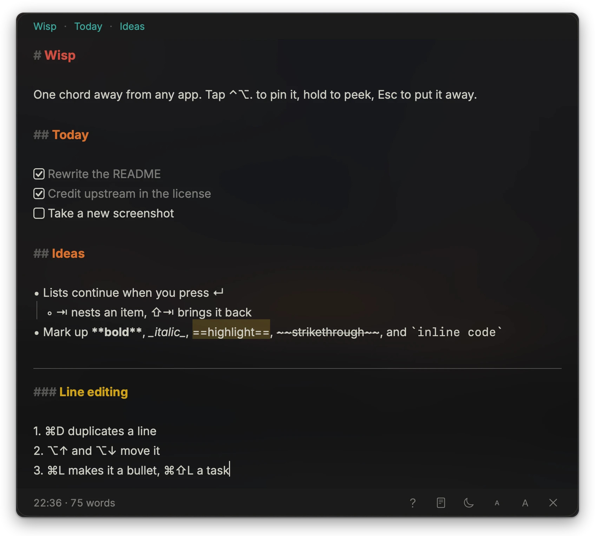

# Wisp

A menu bar scratchpad for macOS. Press ⌃⌥. in any app to open one Markdown note, write, and press Esc to put it away.

Wisp began as a fork of [sulemaanhamza/wisp](https://github.com/sulemaanhamza/wisp) and has since diverged. It keeps upstream's panel and editor, and adds a hand-edited config file, a keymap you can rebind, list and task editing, hold-to-peek, and a movable panel. It drops upstream's updater and onboarding tour. This is a personal build with no releases. Build it from source.

<p align="center">
  
</p>

## Contents

- [Install](#install)
- [Use Wisp](#use-wisp)
  - [Open and close the panel](#open-and-close-the-panel)
  - [Write](#write)
  - [Format text](#format-text)
  - [Edit lines](#edit-lines)
  - [Change the view](#change-the-view)
  - [Store and sync the note](#store-and-sync-the-note)
- [Configure Wisp](#configure-wisp)
  - [Settings](#settings)
  - [Shortcuts](#shortcuts)
- [Build from source](#build-from-source)
- [Sign with a stable identity](#sign-with-a-stable-identity)
- [License](#license)

## Install

Wisp needs macOS 13 or later and the Command Line Tools. It doesn't need Xcode.

```sh
./scripts/install.sh
```

The script builds the app, quits any running copy, and copies the bundle to `/Applications/Wisp.app`. To install somewhere else, set `WISP_INSTALL_DIR`. Open Wisp, then turn on **Launch at Login** in the menu bar menu if you want it.

Run Wisp from the installed copy, not from `dist/`. macOS records the login item against the bundle's path, so a rebuild or a move can orphan a login item that points into `dist/`.

To remove Wisp, run the uninstall script. It quits Wisp and withdraws the login item before it deletes the app. It keeps your config unless you pass `--purge`.

```sh
./scripts/uninstall.sh
```

## Use Wisp

Press ⌘/ or F1, or click `?` in the footer, for the full shortcut list inside the app. The links along its top jump to each section.

### Open and close the panel

- Tap ⌃⌥. to pin the panel open. Tap it again to close it.
- Hold ⌃⌥. to peek. The panel opens without taking focus and closes when you let go. `peekHold` sets how long a press must last to count as a hold.
- Press Esc to close the panel. Esc only acts while the panel has focus, so a panel left open behind another app stays put. If the find bar, the help page, or a folder picker is open, Esc closes that first.
- Drag the panel by any part that isn't text. It opens in the same place next time. **Reset Position** (⌥⌘0) moves it back to the default spot.
- Left-click the menu bar icon to pin the panel. Right-click it, or Control-click, for the menu.

To change the ⌃⌥. chord, choose **Set Shortcut…** in the menu bar menu, or edit `keymap.summon` in the config.

### Write

Wisp styles Markdown as you type and leaves the markers on screen, dimmed.

- A line that starts with `- ` renders as a bullet with a hanging indent. ⇥ and ⇧⇥ nest and un-nest the item. ⌫ inside the indent also un-nests it, and ⌫ at the start of the text removes the marker.
- ↵ continues a list. ↵ on an empty nested item moves it out one level. ⇧↵ continues the same item on a new line.
- `- [ ]` renders as a checkbox. Click it or press ⌘⇧L to check it off.
- `#` through `######` render bold, with a different color for each level and the `#` marks dimmed. A line of text directly above `===` becomes a level-1 heading, and directly above `---`, a level-2 heading, as on GitHub and in Obsidian. The header strip lists the level-1 and level-2 headings, and a click jumps to one. ⌃⇧↑ and ⌃⇧↓ step through headings at every level.
- A line of three or more `-`, `*`, or `_` becomes a divider, with or without spaces between them: `---`, `***`, `* * *`. Under a line of text, `---` makes a heading instead, so leave a blank line above it or use `***`. Wisp doesn't draw dividers inside a fenced code block, or in the `---` frontmatter block at the top of a note. A blank line next to a divider is shorter than a full line, one em tall. Set `rule` to `seam` to draw dividers as a centered `*  *  *`, the way a book marks a scene break.
- Press ↵ three times after a paragraph to insert a divider with a blank line on each side. Press ↵ a fourth time to take the divider back out.
- `--` after a word becomes an em dash (—). Type a third `-` to get `---` back, or `>` to get `-->`. At the start of a line, and in code, `--` stays as typed.
- ⌘V onto a blank line converts a tab-separated grid to a pipe table, and a run of short plain lines to a bulleted list. Anywhere else, ⌘V pastes the text unchanged. Set `smartPaste` to `false` to turn this off.
- ⌘F searches the note.
- F6 or ⌘; turns spell checking on and off, as does the `Abc` button in the footer. Misspelled words get a dotted underline, and right-clicking one lists suggestions. Wisp never corrects a word on its own, and it doesn't check inline code, code blocks, or frontmatter.

### Format text

Each shortcut wraps the selection in the markers shown.

| Style         | Shortcut | Markers       |
| ------------- | -------- | ------------- |
| Bold          | ⌘B       | `**text**`    |
| Italic        | ⌘I       | `_text_`      |
| Highlight     | ⌥H       | `==text==`    |
| Underline     | ⌘U       | `<u>text</u>` |
| Strikethrough | ⌘⇧S      | `~~text~~`    |
| Inline code   | ⌘E       | `` `text` ``  |

Markdown has no underline, and `__` is already bold, so underline writes `<u>`, as Obsidian's underline command does. Strikethrough writes `~~text~~`, which is what Obsidian writes and Notion exports. Wisp also renders a single `~text~`, which Notion accepts as you type. Inline code renders in `fonts.code`. Wisp doesn't style fenced code blocks.

You can also wrap a selection by typing a marker. `` ` ``, `_`, `'`, and `"` wrap it in one of that character. `*`, `=`, and `~` wrap it in two, for bold, highlight, and strikethrough. Typing a marker only wraps and never unwraps, so a second press nests. To replace a selection with one of these seven characters, clear the selection first.

A backslash escapes the character after it, so `` \` `` is a literal backtick and doesn't start a code span. Wisp honors Obsidian's escapes, ``\` \* \_ \# \| \~`` and the `\.` after a list number, plus `\= \< \+ \-` and `\\`. The backslash stays on screen, dimmed.

### Edit lines

- ⌘D duplicates the line, or the selection if there is one.
- ⌘↩ opens a new line below the current one, and ⌘⇧↩ opens one above. The new line keeps the current line's indent.
- ⌥↑ and ⌥↓ move the line up and down.
- With nothing selected, ⌘C and ⌘X copy or cut the whole line. ⌘V then inserts that line above the current one.
- ⌘L turns the line into a bullet, or back into plain text.
- ⌘⇧L turns the line into a task, or checks off a task.

### Change the view

- ⌘= and ⌘- make the text larger and smaller, and ⌘0 resets it. The footer shows the size as `− 100% +`. Click `−` or `+` to change it, and click the percentage to reset it.
- Click the line and word count in the footer to show when the note was last saved instead, such as `last modified: 5 min ago`. Click it again to switch back. Wisp remembers the choice.
- ⌘T cycles the theme through light, dark, and the macOS setting.
- ⌘⇧V turns on source view, which drops all styling and sets the whole note in `fonts.code`, so the screen shows the file as it is. List continuation on ↵ still works, but `---` no longer turns into a divider. Source view resets when you quit.

F1 and F6 reach Wisp only if macOS is set to **Use F1, F2, etc. keys as standard function keys** in Keyboard settings. Otherwise they do what their key caps show, such as dimming the display. Press fn with the key, or use ⌘/ and ⌘; instead.

### Store and sync the note

Wisp saves the note as plain Markdown at `~/Documents/scratchpad.md`. To keep it in sync across Macs, choose **Scratchpad Folder…** in the menu bar menu and pick a folder that iCloud Drive, Dropbox, or Syncthing syncs. **Reset Scratchpad Folder** goes back to `~/Documents`.

Wisp watches the note's folder and the config folder. A change from another app, another Mac, or a sync client shows up without a reload. If a watch can't start, the footer says so. ⌘R re-reads the note and the config from disk either way.

## Configure Wisp

### Settings

Wisp keeps all its settings in `~/.config/wisp/wisp.jsonc`, or `$XDG_CONFIG_HOME/wisp/wisp.jsonc` if that variable is set. Wisp writes the file with defaults on first launch. To open it, choose **Settings…** in the menu bar menu or press ⌘,.

Wisp reads the file as JSON5, so comments and trailing commas are fine. A missing key takes its default. A key with the wrong shape is ignored, and the footer names it. Changes apply as soon as you save. When you change a setting from the app, Wisp rewrites only that key and leaves your comments, key order, and indentation alone.

The file's `$schema` key points at `wisp.schema.json` in the same folder. Wisp copies that schema out of its bundle at every launch, so Zed, VS Code, and other editors that read `$schema` can validate and complete the file offline.

| Key                  | Default              | Effect                                                                                                                                                |
| -------------------- | -------------------- | ----------------------------------------------------------------------------------------------------------------------------------------------------- |
| `theme`              | `"system"`           | `light`, `dark`, or `system` to follow macOS                                                                                                          |
| `fonts.notes`        | _(system font)_      | The note's font, by family name                                                                                                                       |
| `fonts.ui`           | _(system font)_      | The font for the header, footer, and overlays                                                                                                         |
| `fonts.code`         | _(system monospace)_ | The font for inline code, and for the whole note in source view                                                                                       |
| `fontScale`          | `1.0`                | Multiplies every text size. ⌘= and ⌘- step it by 0.1. Wisp clamps it to 0.6–2.5                                                                       |
| `defaultFontScale`   | `1.0`                | The value ⌘0 resets `fontScale` to                                                                                                                    |
| `background.blur`    | `true`               | Blurs whatever is behind the panel                                                                                                                    |
| `background.opacity` | _(theme's own)_      | The panel tint's opacity, 0–1. `1` makes the panel solid                                                                                              |
| `monitor`            | `"primary"`          | `pointer` opens the panel on the display under the cursor, and moves a saved position to the same relative spot there                                 |
| `position`           | _(written on drag)_  | The panel's top-left `x` and `y` in screen points, saved when a dragged panel closes. `null` is the default spot: centered, with the top edge 5% down |
| `peekHold`           | `250`                | Milliseconds to hold the summon chord before the panel peeks instead of pinning. `0` always peeks                                                     |
| `saveIndicator`      | `true`               | Flashes a dot in the top corner each time Wisp saves the note                                                                                         |
| `smartPaste`         | `true`               | Converts a pasted grid to a table and pasted short lines to a list, when you paste onto a blank line                                                  |
| `scratchpadFolder`   | `""`                 | The folder that holds `scratchpad.md`. Empty means `~/Documents`                                                                                      |
| `indent.style`       | `"spaces"`           | What ⇥ writes: `spaces` or `tabs`                                                                                                                     |
| `indent.size`        | `2`                  | Spaces per indent level. Ignored when `indent.style` is `tabs`                                                                                        |
| `caret.motion`       | `"snappy"`           | How the caret moves. `snappy` lands at once and settles, `gliding` slides, and `off` jumps. Reduce Motion forces `off`                                |
| `caret.blink`        | `true`               | Fades the caret in and out while idle. `false` keeps it solid                                                                                         |
| `rule`               | `"line"`             | How a divider is drawn: `line` for a thin line across the note, `seam` for a centered `*  *  *`                                                       |
| `spellcheck`         | `false`              | Checks spelling as you type. F6, ⌘;, and the footer's `Abc` button toggle it                                                                          |
| `footerStatus`       | `"position"`         | What the footer's label shows: `position` for line, column, and word count, `modified` for when the note was saved                                    |
| `keymap.*`           | _(see below)_        | Every shortcut                                                                                                                                        |
| `panel`              | _(written on close)_ | The panel's last `width` and `height`                                                                                                                 |

Wisp bundles no fonts. It looks up a named family by name, and if the family isn't installed, it uses the system font and says so in the footer.

### Shortcuts

Wisp writes every binding under `keymap` on first launch. A chord is modifiers plus one key, in any order: `cmd+shift+d`, `opt+up`, `ctrl+opt+.`. `hyper` stands for all four modifiers, so `hyper+.` means `ctrl+opt+shift+cmd+.`, which is what a Caps Lock key remapped to a hyper key sends.

An action can take a list of chords instead of one, and every chord in the list works. For example, `"help": ["f1", "cmd+/"]`.

`summon` is the only global shortcut. `find`, `settings`, and `refresh` also work while Wisp is active with the panel closed, and they open the panel. The rest work only while the panel is in front. The menu bar menu shows each item's current chord, and those chords work while the menu is closed.

Wisp drops a chord it can't parse. If that leaves an action with no working chord, the footer names the action.

| Action               | Default            |
| -------------------- | ------------------ |
| `summon`             | `ctrl+opt+.`       |
| `find`               | `cmd+f`            |
| `settings`           | `cmd+,`            |
| `refresh`            | `cmd+r`            |
| `reveal`             | `opt+cmd+r`        |
| `resetPosition`      | `cmd+opt+0`        |
| `help`               | `["f1", "cmd+/"]`  |
| `cycleTheme`         | `cmd+t`            |
| `sourceView`         | `cmd+shift+v`      |
| `spellcheck`         | `["f6", "cmd+;"]`  |
| `bold`               | `cmd+b`            |
| `italic`             | `cmd+i`            |
| `highlight`          | `opt+h`            |
| `underline`          | `cmd+u`            |
| `strikethrough`      | `cmd+shift+s`      |
| `code`               | `cmd+e`            |
| `duplicateLine`      | `cmd+d`            |
| `openLineBelow`      | `cmd+return`       |
| `openLineAbove`      | `cmd+shift+return` |
| `bulletedList`       | `cmd+l`            |
| `checklist`          | `cmd+shift+l`      |
| `moveLineUp`         | `opt+up`           |
| `moveLineDown`       | `opt+down`         |
| `previousHeading`    | `ctrl+shift+up`    |
| `nextHeading`        | `ctrl+shift+down`  |
| `increaseFontScale`  | `cmd+=`            |
| `decreaseFontScale`  | `cmd+-`            |
| `resetFontScale`     | `cmd+0`            |

## Build from source

```sh
./scripts/build.sh
open dist/Wisp.app
```

`build.sh` assembles `dist/Wisp.app` by hand, because SwiftPM builds only a bare executable. From `MacOSX27.0.sdk` on, SwiftUI needs a compiler plugin that ships only with Xcode, so `build.sh` builds against the newest Command Line Tools SDK older than 27. To use a specific SDK, set `WISP_SDKROOT` to its path.

To run the tests:

```sh
./scripts/test.sh
```

Plain `swift test` fails with `no such module 'Testing'`. Swift Testing ships inside the Command Line Tools but isn't on the default search path, so `test.sh` points the compiler, the linker, and dyld at it.

To run Wisp without building a bundle, use `swift run`. Launch at Login and the bundled config schema need the bundle, so they don't work this way. `swift run` uses the default SDK, so if that SDK is `MacOSX27.0.sdk` or later, set `SDKROOT` to an older one first.

```sh
swift run
```

## Sign with a stable identity

`build.sh` signs the app ad hoc by default. Each build gets a new code identity, so macOS can ask you to approve Launch at Login again after a rebuild. To keep one identity across builds without Xcode or a paid developer account, create a self-signed certificate in Keychain Access. Choose **Certificate Assistant > Create a Certificate**, set the type to **Code Signing**, then build with it:

```sh
WISP_SIGN_IDENTITY="Your Cert Name" ./scripts/build.sh
```

## License

MIT. See [LICENSE](LICENSE).
